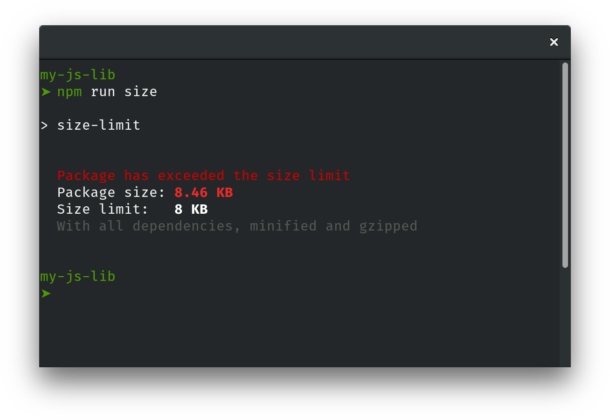
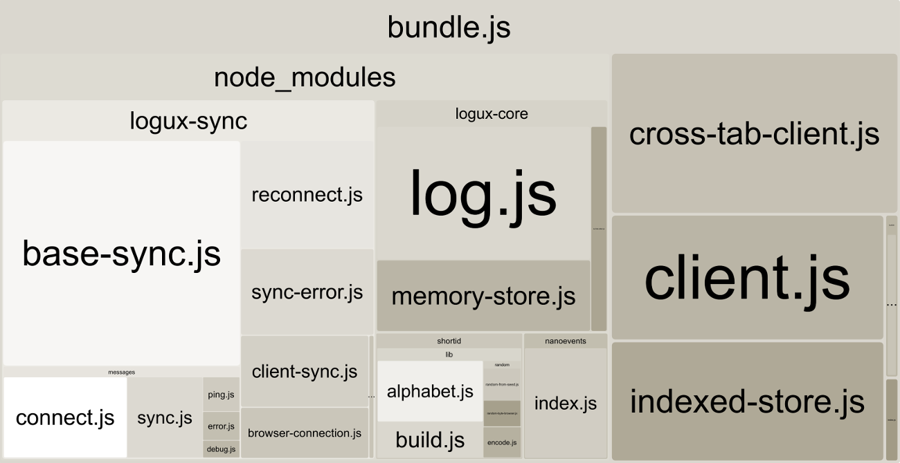

# Size Limit

Size Limit is a tool to prevent JavaScript libraries bloat.
With it, you know exactly for how many kilobytes your JS library
increases the user bundle.

You can add Size Limit to your continuous integration service
(such as Travis CI) and set the limit. If you accidentally
add a massive dependency, Size Limit will throw an error.

<p align="center">
  
</p>

<p align="center">
  <a href="https://evilmartians.com/?utm_source=size-limit">
    
  </a>
</p>

## Usage

First, install `size-limit`:

```sh
$ npm install --save-dev size-limit
```

Here's how you can get the size for your current project:

```sh
$ ./node_modules/bin/size-limit

  Package size: 8.46 KB
  With all dependencies, minified and gzipped

```

If your project size starts to look bloated,
run [Webpack Bundle Analyzer](https://github.com/th0r/webpack-bundle-analyzer)
for analysis:

```sh
./node_modules/bin/size-limit --why
```

<p>
  
</p>

Now, let's set the limit. Determine the current size of your library,
add just a little bit (a kilobyte, maybe) and use that as a limit
when adding the script to `package.json`:

```diff json
  "scripts": {
    "test": "jest && eslint .",
+    "size": "size-limit 9KB"
  }
```

Add the `size` script to your test suite:

```diff js
  "scripts": {
-    "test": "jest && eslint .",
+    "test": "jest && eslint . && npm run size",
    "size": "size-limit 9KB"
  }
```

If you don't have a continuous integration service running, don’t forget
to add one — start with [Travis CI](https://github.com/dwyl/learn-travis).

## JavaScript API

```js
const getSize = require('size-limit')

const index = path.join(__dirname, 'index.js')
const extra = path.join(__dirname, 'extra.js')

getSize([index, extra]).then(size => {
  if (size > 1 * 1024 * 1024) {
    console.error('Project is now larger than 1MB!')
  }
})
```

## Who Uses Size Limit

* [Autoprefixer](https://github.com/postcss/autoprefixer)
* [PostCSS](https://github.com/postcss/postcss)
* [JSS](https://github.com/cssinjs/jss)
* [Logux](https://github.com/logux)

## Comparison with `bundlesize`

Main difference between Size Limit and `bundlesize`, that Size Limit uses
webpack to build bundle. It has more accurate result and can show you
_what_ and _why_ causes the bloat.

1. Size Limit has the `--why` mode to run Webpack Bundle Analyzer — this way,
   you can see what went wrong in a nice graphical representation.
2. It uses webpack to more accurate result. For instance, it will show
   `process` and other polyfills added by webpack.
3. You don’t need to specify all your files. Because Size Limit uses webpack
   it will build bundle based on `require()` calls.
4. It shows result after UglifyJS (or Babili for ES2016+ projects).
