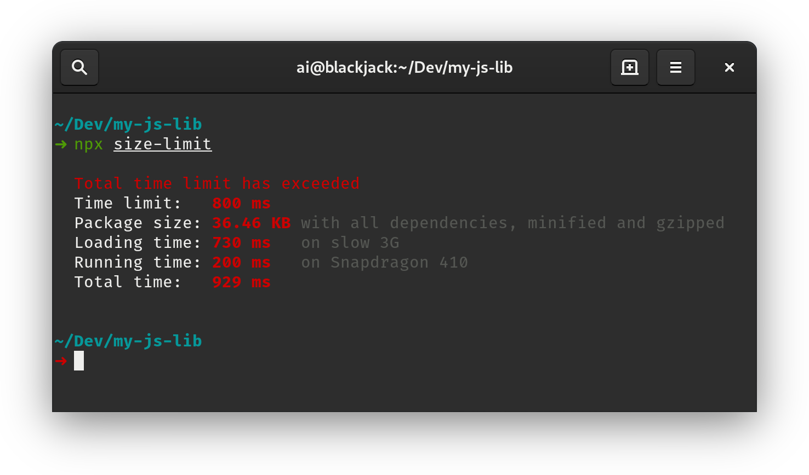
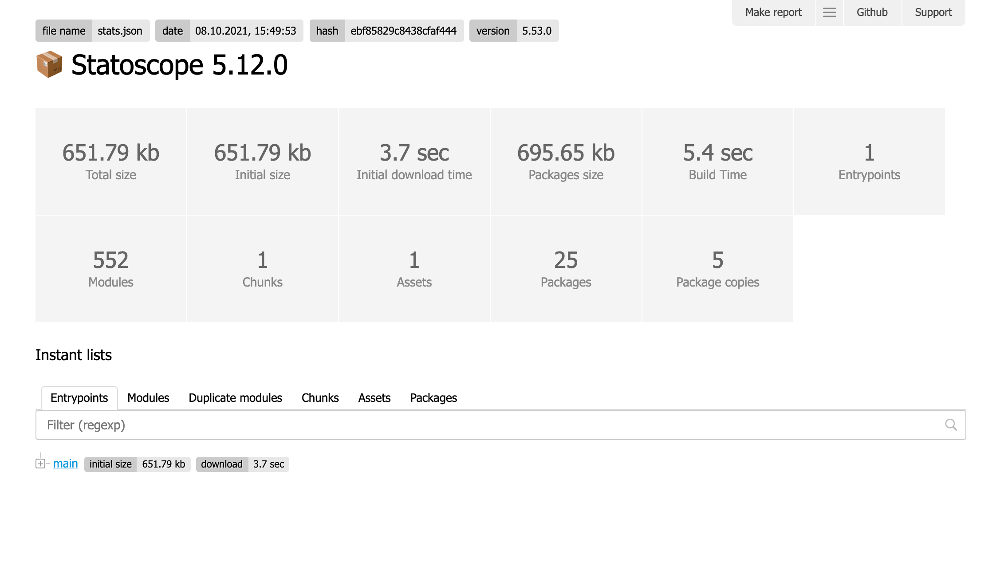

# Size Limit [![Cult Of Martians][cult-img]][cult]


Size Limit is a tool to prevent JavaScript libraries bloat.
With it, you know exactly for how many kilobytes your JS library
increases the user bundle.

You can add Size Limit to your continuous integration service
(such as Travis CI) and set the limit. If you accidentally
add a massive dependency, Size Limit will throw an error.

<p align="center">
  
</p>

Size Limit could tell you not only library size. With `--why` argument it can
tell you *why* your library has this size and show real cost of all your
internal dependencies.

<p align="center">
  
</p>

<p align="center">
  <a href="https://evilmartians.com/?utm_source=size-limit">
    
  </a>
</p>

[Size Limit: Make the Web lighter]: https://evilmartians.com/chronicles/size-limit-make-the-web-lighter
[cult-img]:                         http://cultofmartians.com/assets/badges/badge.svg
[cult]:                             http://cultofmartians.com/tasks/size-limit-config.html

## Who Uses Size Limit

* [MobX](https://github.com/mobxjs/mobx)
* [Material-UI](https://github.com/callemall/material-ui)
* [Autoprefixer](https://github.com/postcss/autoprefixer)
* [PostCSS](https://github.com/postcss/postcss) reduced
  [25% of the size](https://github.com/postcss/postcss/commit/150edaa42f6d7ede73d8c72be9909f0a0f87a70f).
* [Browserslist](https://github.com/ai/browserslist) reduced
  [25% of the size](https://github.com/ai/browserslist/commit/640b62fa83a20897cae75298a9f2715642531623).
* [EmojiMart](https://github.com/missive/emoji-mart) reduced [20% of the size](https://github.com/missive/emoji-mart/pull/111)
* [nanoid](https://github.com/ai/nanoid) reduced
  [33% of the size](https://github.com/ai/nanoid/commit/036612e7d6cc5760313a8850a2751a5e95184eab).
* [Logux](https://github.com/logux) reduced
  [90% of the size](https://github.com/logux/logux-client/commit/62b258e20e1818b23ae39b9c4cd49e2495781e91).


## How It Works

You can find more examples in **[Size Limit: Make the Web lighter]** article.

To be really specific, Size Limit creates an empty webpack project in memory.
Then, it adds your library as a dependency to the project and calculates
the real cost of your libraries, including all dependencies, webpack’s polyfills
for process, etc.


## Usage

First, install `size-limit`:

```sh
$ npm install --save-dev size-limit
```

Add `size-limit` section to `package.json` and `size` script:

```diff
+ "size-limit": [
+   {
+     "path": "index.js"
+   }
+ ],
  "scripts": {
+   "size": "size-limit",
    "test": "jest && eslint ."
  }
```

The `path` option:

* For an open source library, specify compiled sources, which will be published
  to npm (usually the same value as the `main` field in the `package.json`);
* For an application, specify a bundle file and use `webpack: false` (see the
  [Applications](#applications) section).

Here’s how you can get the size for your current project:

```sh
$ npm run size

  Package size: 8.46 KB
  With all dependencies, minified and gzipped

```

If your project size starts to look bloated,
run [Webpack Bundle Analyzer](https://github.com/th0r/webpack-bundle-analyzer)
for analysis:

```sh
$ npm run size -- --why
```

Now, let’s set the limit. Determine the current size of your library,
add just a little bit (a kilobyte, maybe) and use that as a limit in
your `package.json`:

```diff
 "size-limit": [
    {
+     "limit": "9 KB",
      "path": "index.js"
    }
 ],
```

Add the `size` script to your test suite:

```diff
  "scripts": {
    "size": "size-limit",
-   "test": "jest && eslint ."
+   "test": "jest && eslint . && npm run size"
  }
```

If you don’t have a continuous integration service running, don’t forget
to add one — start with [Travis CI](https://github.com/dwyl/learn-travis).


## Config

Size Limits supports 3 ways to define config.

1. `size-limit` section to `package.json`:

   ```json
     "size-limit": [
       {
         "path": "index.js",
         "limit": "9 KB"
       }
     ]
   ```

2. or separated `.size-limit` config file:

   ```js
   [
     {
       path: "index.js",
       limit: "9 KB"
     }
   ]
   ```

3. or more flexible `.size-limit.js` config file:

   ```js
   module.exports = [
     {
       path: "index.js",
       limit: "9 KB"
     }
   ]
   ```

Each section in config could have options:

* **path**: relative paths to files. The only mandatory option.
  It could be a path `"index.js"`, a pattern `"dist/app-*.js"`
  or an array `["index.js", "dist/app-*.js"]`.
* **limit**: size limit for files from `path` option. It should be a string
  with a number and unit (`100 B`, `10 KB`, etc).
* **name**: the name of this section. It will be useful only
  if you have multiple sections.
* **webpack**: with `false` will disable webpack.
* **gzip**: with `false` will disable gzip compression.
* **config**: a path to custom webpack config.


## Applications

Webpack inside Size Limit is very useful for small open source library.
But if you want to use Size Limit for application, not open source library, you
could already have webpack to make bundle.

In this case you can disable internal webpack:

```diff
 "size-limit": [
    {
      "limit": "300 KB",
+     "webpack": false,
      "path": "public/app-*.js"
    }
 ],
```


## JavaScript API

```js
const getSize = require('size-limit')

const index = path.join(__dirname, 'index.js')
const extra = path.join(__dirname, 'extra.js')

getSize([index, extra]).then(size => {
  if (size.gzip > 1 * 1024 * 1024) {
    console.error('Project is now larger than 1MB!')
  }
})
```


## Comparison with `bundlesize`

Main difference between Size Limit and `bundlesize`, that Size Limit uses
webpack to build bundle. It has more accurate result and can show you
_what_ and _why_ causes the bloat.

1. Size Limit has the `--why` mode to run Webpack Bundle Analyzer — this way,
   you can see what went wrong in a nice graphical representation.
2. Instead of bundlesize, Size Limit prevents the most popular source
   of libraries bloat — unexpected huge dependency.
3. Also Size Limit prevents increasing library size because of wrong `process`
   or `path` usage, when webpack will add big unnecessary polyfill.
4. Size Limit runs only on first CI job, so it is more respectful
   to CI resources.
