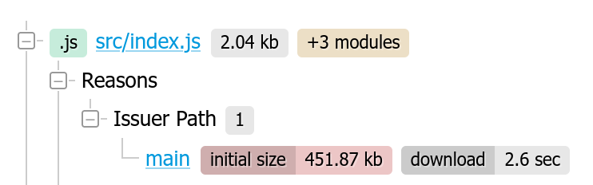

# Size Limit [![Cult Of Martians][cult-img]][cult]


Size Limit is a linter for your JS application or library performance.
It calculates the real cost of your JS for end-users and throws an error
if the cost exceeds the limit.

* Size Limit calculate the **time**, which browser need to
  **download** and **execute** your JS. It’s much more accurate
  and understandable metric compare to size in bytes.
* Size Limit counts the cost including **all dependencies and polyfills**
  which is used in your JS.
* You can add Size Limit to **Travis CI**, **Circle CI**, etc and set the limit.
  If pull added a massive dependency, CI will show an error.

<p align="center">
  
</p>

With `--why` Size Limit can tell you *why* your library has this size
and show the real cost of all your internal dependencies.

<p align="center">
  
</p>

<p align="center">
  <a href="https://evilmartians.com/?utm_source=size-limit">
    
  </a>
</p>

[cult-img]: http://cultofmartians.com/assets/badges/badge.svg
[cult]:     http://cultofmartians.com/tasks/size-limit-config.html

## Who Uses Size Limit

* [MobX](https://github.com/mobxjs/mobx)
* [Material-UI](https://github.com/callemall/material-ui)
* [Autoprefixer](https://github.com/postcss/autoprefixer)
* [PostCSS](https://github.com/postcss/postcss) reduced
  [25% of the size](https://github.com/postcss/postcss/commit/150edaa42f6d7ede73d8c72be9909f0a0f87a70f).
* [Browserslist](https://github.com/ai/browserslist) reduced
  [25% of the size](https://github.com/ai/browserslist/commit/640b62fa83a20897cae75298a9f2715642531623).
* [EmojiMart](https://github.com/missive/emoji-mart) reduced [20% of the size](https://github.com/missive/emoji-mart/pull/111)
* [nanoid](https://github.com/ai/nanoid) reduced
  [33% of the size](https://github.com/ai/nanoid/commit/036612e7d6cc5760313a8850a2751a5e95184eab).
* [React Focus Lock](https://github.com/theKashey/react-focus-lock) reduced [32% of the size](https://github.com/theKashey/react-focus-lock/pull/48).
* [Logux](https://github.com/logux) reduced
  [90% of the size](https://github.com/logux/logux-client/commit/62b258e20e1818b23ae39b9c4cd49e2495781e91).


## How It Works

1. Applications bundles JS files into the single file. Otherwise, many small
   JS libraries have many small separated files. For this libraries Size Limit
   **creates an empty webpack** project Then, it adds your library
   as a dependency to the project and calculates the real cost
   of your libraries, including all dependencies and webpack’s polyfills.
   Size Limit doesn’t run webpack for application, which already has JS bundle.
2. Size Limit compare current machine performance with low-priced Android devices
   to calculate **CPU throttling rate**.
3. To be specific, Size Limit runs **headless Chrome**
   with CPU throttling rate. Then it loads your JS code there and tracks the time
   using by Chrome to compile and execute JS.


## Usage for Applications and Big Libraries

This guide is for two use cases:

* Application with bundler (like webpack or Parcel). Any React or Vue.js
  application is this use case.
* JS libraries, which use webpack or Rollup to build
  `dist/umd/lib.produciton.js`-kind file to put it to npm package.
  [React] is a good example.

If you have a small JS library with many separated files in npm package,
see the next section.

1. First, install `size-limit`:

    ```sh
    $ npm install --save-dev size-limit
    ```

2. Add `size-limit` section to `package.json` and `size` script:

    ```diff
    + "size-limit": [
    +   {
    +     "webpack": false,
    +     "path": "dist/app-*.js"
    +   }
    + ],
      "scripts": {
        "build": "webpack ./webpack.config.js",
    +   "size": "npm run build && size-limit",
        "test": "jest && eslint ."
      }
    ```

3. Here’s how you can get the size for your current project:

    ```sh
    $ npm run size

      Package size: 30.08 KB with all dependencies, minified and gzipped
      Loading time: 602 ms   on slow 3G
      Running time: 214 ms   on Snapdragon 410
      Total time:   815 ms
    ```
4. Now, let’s set the limit. Add 25% for current total time and use that as
   a limit in your `package.json`:

    ```diff
      "size-limit": [
        {
    +     "limit": "1 s",
          "webpack": false,
          "path": "dist/app-*.js"
        }
      ],
    ```

5. Add the `size` script to your test suite:

    ```diff
      "scripts": {
        "build": "webpack ./webpack.config.js",
        "size": "npm run build && size-limit",
    -   "test": "jest && eslint ."
    +   "test": "jest && eslint . && npm run size"
      }
    ```

6. If you don’t have a continuous integration service running, don’t forget
   to add one — start with [Travis CI].

## Usage for Small Libraries

This guide is for small JS libraries with many small separated files
in their npm package. [Nano ID] or [Storeon] could be a good example.

1. First, install `size-limit`:

    ```sh
    $ npm install --save-dev size-limit
    ```

2. Add `size-limit` section to `package.json` and `size` script:

    ```diff
    + "size-limit": [
    +   {
    +     "path": "index.js"
    +   }
    + ],
      "scripts": {
    +   "size": "size-limit",
        "test": "jest && eslint ."
      }
    ```

3. Here’s how you can get the size for your current project:

    ```sh
    $ npm run size

      Package size: 177 B with all dependencies, minified and gzipped
      Loading time: 10 ms on slow 3G
      Running time: 49 ms on Snapdragon 410
      Total time:   59 ms
    ```

4. If your project size starts to look bloated, run `--why` for analysis:

    ```sh
    $ npm run size -- --why
    ```

5. Now, let’s set the limit. Determine the current size of your library,
   add just a little bit (a kilobyte, maybe) and use that as a limit
   in your `package.json`:

    ```diff
     "size-limit": [
        {
    +     "limit": "9 KB",
          "path": "index.js"
        }
     ],
    ```

6. Add the `size` script to your test suite:

    ```diff
      "scripts": {
        "size": "size-limit",
    -   "test": "jest && eslint ."
    +   "test": "jest && eslint . && npm run size"
      }
    ```

7. If you don’t have a continuous integration service running, don’t forget
   to add one — start with [Travis CI].

[Travis CI]: https://github.com/dwyl/learn-travis
[Storeon]: https://github.com/ai/storeon/
[Nano ID]: https://github.com/ai/nanoid/
[React]: https://github.com/facebook/react/


## Config

Size Limits supports three ways to define config.

1. `size-limit` section to `package.json`:

   ```json
     "size-limit": [
       {
         "path": "index.js",
         "limit": "500 ms"
       }
     ]
   ```

2. or separated `.size-limit.json` config file:

   ```js
   [
     {
       "path": "index.js",
       "limit": "500 ms"
     }
   ]
   ```

3. or more flexible `.size-limit.js` config file:

   ```js
   module.exports = [
     {
       path: "index.js",
       limit: "500 ms"
     }
   ]
   ```

Each section in the config could have options:

* **path**: relative paths to files. The only mandatory option.
  It could be a path `"index.js"`, a pattern `"dist/app-*.js"`
  or an array `["index.js", "dist/app-*.js"]`.
* **entry**: when using a custom webpack config, a webpack entry could be given.
  It could be a string or an array of strings.
  By default, the total size of all entry points will be checked.
* **limit**: size or time limit for files from `path` option. It should be
  a string with a number and unit. Format: `100 B`, `10 KB`, `500 ms`, `1 s`.
* **name**: the name of this section. It will be useful only
  if you have multiple sections.
* **webpack**: with `false` will disable webpack.
* **running**: with `false` will disable calculating running time.
* **gzip**: with `false` will disable gzip compression.
* **config**: a path to custom webpack config.
* **ignore**: an array of files and dependencies to ignore from project size.

If you use Size Limit to track the size of CSS files only set `webpack: false`.
Otherwise, you will get wrong numbers, because webpack inserts `style-loader`
runtime (≈2 KB) into the bundle.


## API

```js
const getSize = require('size-limit')

const index = path.join(__dirname, 'index.js')
const extra = path.join(__dirname, 'extra.js')

getSize([index, extra]).then(size => {
  // size => { gzip, parsed, running, loading }
  if (size.gzip > 1 * 1024 * 1024) {
    console.error('Project is now larger than 1MB!')
  }
})
```
